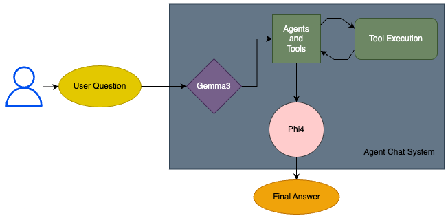

# Network Issues Chat Agent

- AI assistant, targeted multi-linguality
- When needed uses functions as tools
- Open source models are used (default phi4 (14b) for answering and gemma3 (4b) for selecting agent)
- Customizable and extensible framework for building intelligent conversational agents

<p align="center">
  
</p>

## Features
* Multilingual Support 
    * (Prompts and pipelines optimized for Turkish and English.)
* Tool Integration
* Open-Source Models:
    * Phi (14B): Default model for answering, capable of handling long contexts up to 128K tokens.
    * Gemma3 (4B): Used for agent selection to optimize performance.

## Prerequisites
* Python 3.13.3 is used.
* pip, brew, ollama
* internet connection to download models

Clone repo:
```bash
git clone https://github.com/rabiaedayilmaz/network-chatbot-agent.git
cd network-chatbot
```

Set up a virtual environment:
```bash
python3 -m venv .venv
source .venv/bin/activate
```

Install python dependencies:
```bash
export PYTHONPATH=.
pip install -r requirements.txt
```

Install ollama from official website, then:
```bash
brew install ollama
```

Phi4 14B is selected due to long contexts up to 16k tokens and best performing model AMC 12/10 tests on November 2024, plus multilingual capabilities.
Gemma3 is used for efficient agent and tool selection, also 4B little model.
Download them using ollama.
```bash
ollama pull phi4
ollama pull gemma3
```

Start the chat agent:
```bash
python3 main.py
```

To run tests:
```bash
pytest test/
```

## Usage

| Example 1 | Example 2 |
|---------|---------|
|  |  |

Ask questions like:
* kalabalık alanlarda nasıl daha hızlı internete erişirim
* internet hız testi
* yıldız topolojisini açıklar mısın
* diagnostik teşhis github.com
* güvenli internet kullanma alışkanlıkları

### Agents
There are 6 agents and each of them has own personality. Gemma3 will select appropriate agent and tools. Then, Phi4 will answer your problem using them.
- Fixie: Support agent, can use RAG tools.
- Bytefix: Technical network agent, can use shell command tools (ping, tracerouter, nslookup) for given host or IP address.
- RouterX: Network engineer agent, makes suggestions.
- Sentinel: Security agent, makes suggestions.
- Hypernet: Speed optimizer agent, can use internet speed test tool.
- Prof. Ping: Instructor agent, can use topology drawing tool.

## Contributing
Contributions are welcome! To contribute:

- Fork the repository.
- Create a new branch (git checkout -b feature/your-feature).
- Commit your changes (git commit -m "Add your feature").
- Push to the branch (git push origin feature/your-feature).
- Open a pull request.

For any questions/suggestions [mail](edayilmxz@outlook.com) us! 

## Acknowledgments
* Ollama for providing an easy-to-use platform for running AI models.
* Phi4 and Gemma3 for their open-source models.